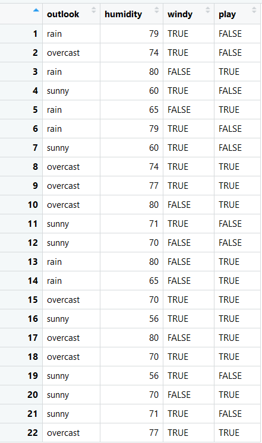
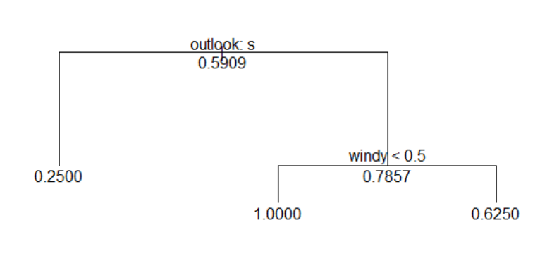
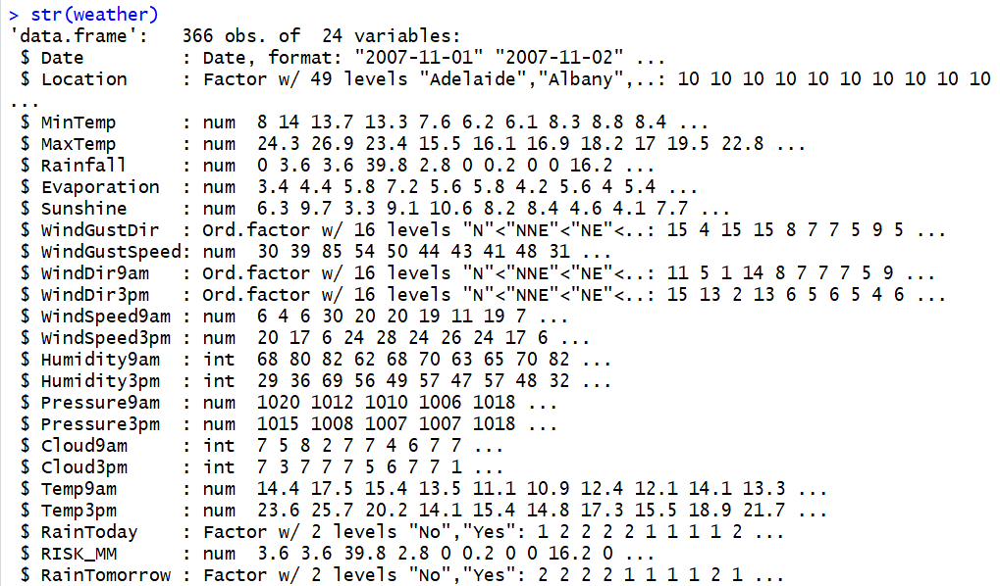
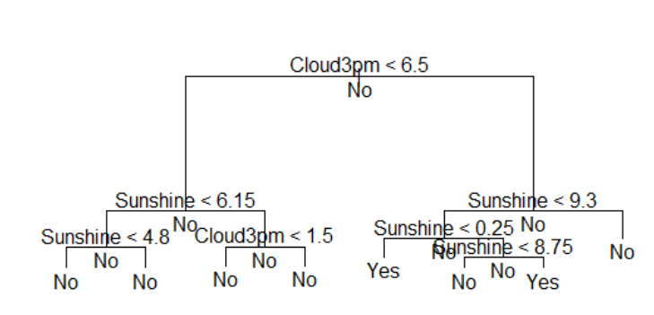
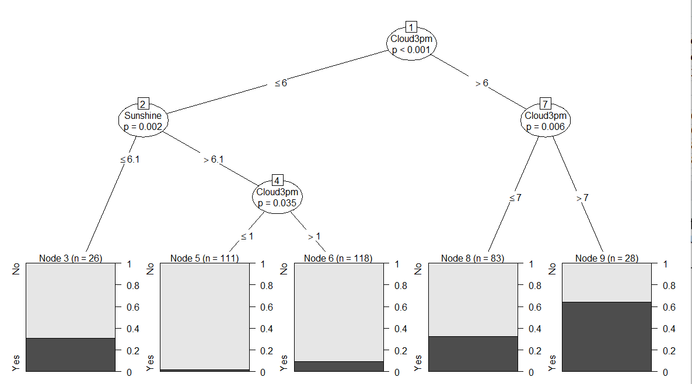
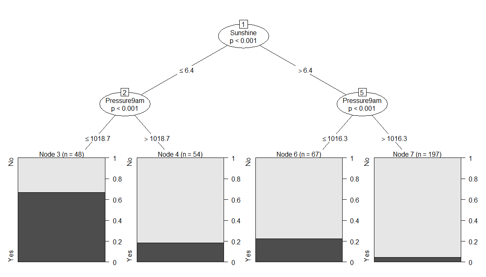
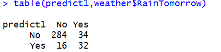
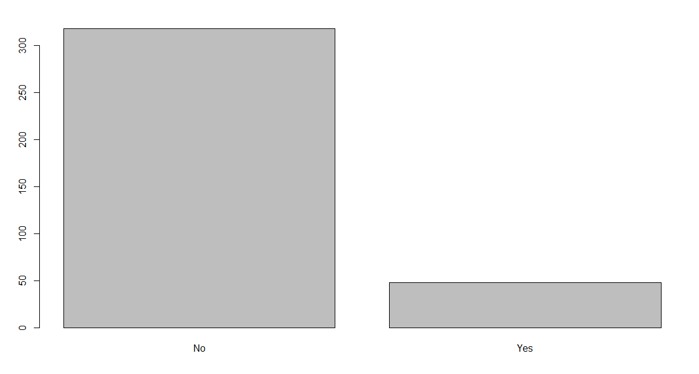

# Machine Learning in R using Decision Tree
To use the weather data (provided by R) and construct a decision tree using the tree package to predict if it will rain tomorrow based on the today’s degree of sunshine and the degree of the cloud availability at 3pm

# <h1> 1) To create a Data frame from the table

  
# <h1> 2) To construct a decision tree from the above table using the tree
package

 
# <h1> 3) To use the weather data provided by R

  
# <h1> 4) To construct a decision tree from tree package to predict if it will rain
tomorrow at 3pm depending on cloud availability

  
# <h1> 5) To change the decision tree form tree to ctree package

  
# <h1> 6) To create a Data frame from the table

  
# <h1> 7) To use the predict function to determine if it will rain tomorrow
and to plot it

